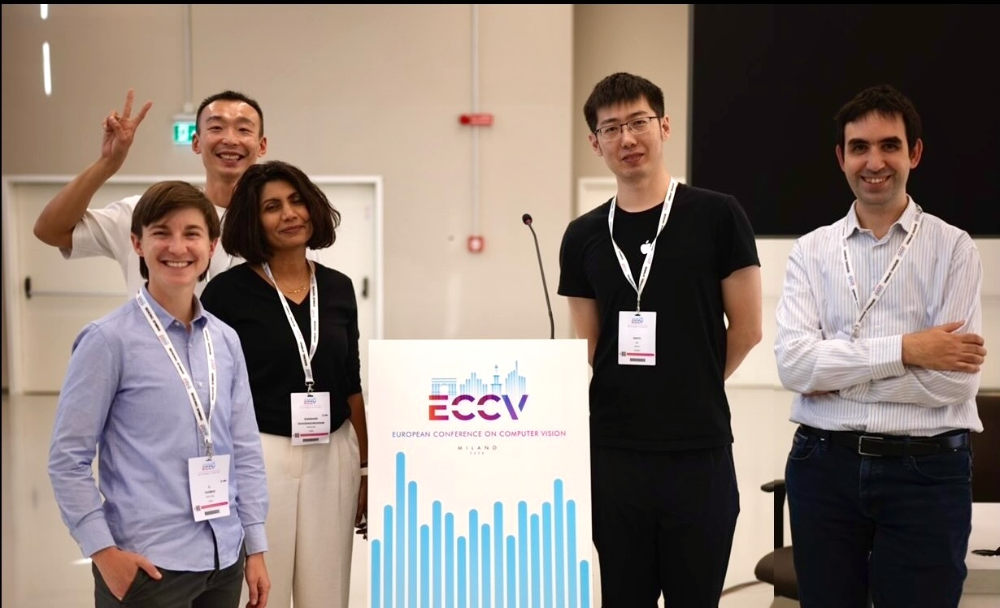
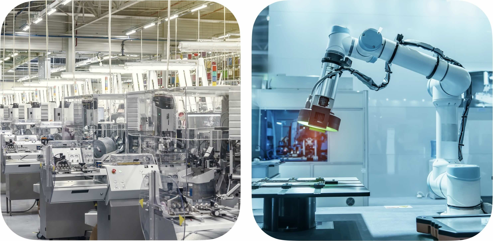
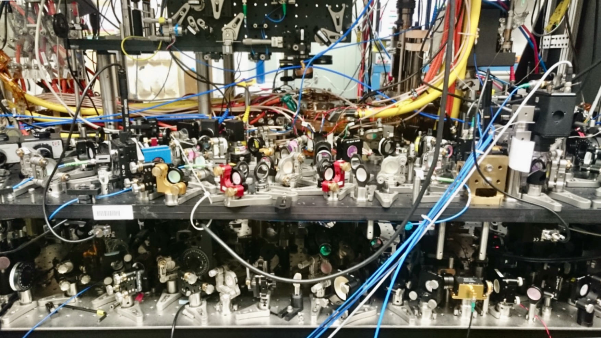
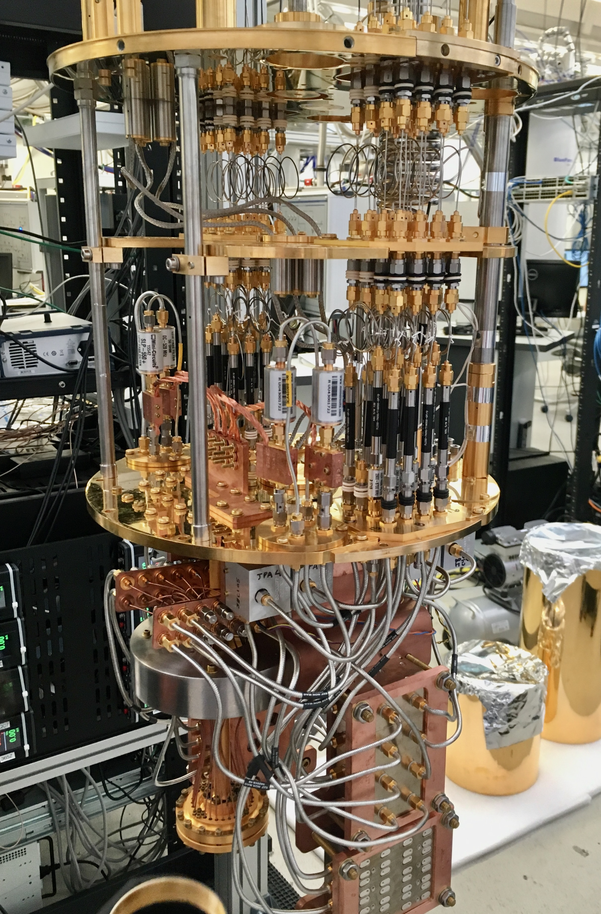

---
# You don't need to edit this file, it's empty on purpose.
# Edit theme's home layout instead if you wanna make some changes
# See: https://jekyllrb.com/docs/themes/#overriding-theme-defaults
layout: home
author_profile: true
---

<!--  -->

## Bio

I lead a machine learning team at [Apple](https://www.apple.com/newsroom/) that translates advances in research to applications in manufacturing. My team's applied research focuses on continual learning, domain generalization, and data-efficient machine learning. Beyond my current role, I am interested in hierarchical learning and mechanistic interpretability of large language and multimodal models.

<!-- why - how - what -->
I have a PhD in Atomic, Molecular and Optical Physics from [UC Berkeley](http://ultracold.physics.berkeley.edu), and professional experience as a machine learning engineer, quantum engineer and startup founder. When I'm not working to understand our world or become a better manager, I enjoy woodworking, cycling, and hiking with my wife and dog. I am also a board member and volunteer assistant instructor at [Impact Bay Area](https://www.impactbayarea.org/cthomas), where we teach self-defense under adrenaline. 

## Research

I am interested in applying today's AI capabilities to important problems in manufacturing, and investigating the mechanics of model decisioning to improve capabilities for tomorrow. 
<!-- I apply today's AI capabilities to important problems in manufacturing, and work to , and in better understanding the underlying mechanics of model decisioning to improve tomorrow's.  -->
My research in physics also encompassed both fundamental research and applications-focused computing. 

<!-- why - understand and discover, and build something impactful or helpful
how - curiosity, developing broad expertise, find underlying commonalities across fields 
what - physics, engineering and machine learning -->
<!-- 
I am broadly driven to understand the world and to leverage that understanding to build something impactful and new. Thus far in my career I've taken that lens in physics, engineering and machine learning.  -->

### AI in Manufacturing
<!-- why - how - what -->

<!-- Why is this important / why is it interesting / why is it hard ?   -->
Successful applications of ML in manufacturing can reduce waste at a global scale while improving the quality of products produced. However, success requires exceptionally high model accuracy on data with low-diversity, a scenario that promotes model memorization and limits adaptability. 
<!-- Domain-specific datasets differ meaningfully from the natural images used in traditional machine learning and many ground-breaking approaches from literature don’t show promising results when applied to real manufacturing scenarios. -->

<!-- how do we work  -->
<!-- My team runs experiments applying cutting edge approaches to our domain-specific data. When we identify a promising approach, we publish,  demonstrating our approaches on open-source medical datasets that share many challenges with manufacturing. Finally, we integrate successful approaches into an internal git repo, so that many ML applications can benefit from our work.   -->

<!-- what have we built -->

My team's recent research leverages self-supervised pretraining and [language-guided domain adaptation](https://openreview.net/forum?id=iyULilaeYx) to reduce the volume of annotated device-specific data required to produce a performant product inspection model. 
I was an organizer and panelist for the [2024 vision workshop at ECCV](https://vision-based-industrial-inspection.github.io/eccv-24/).

### AI Interpretability and Alignment

<!-- why -->
<!-- Today's large models require extremely large datasets, delivered by scraping the whole internet (not humanity’s proudest collection of thoughts). Their predecessors - models that determine what we see on social media, for example - we know can be bad for democracy, teen mental health, and social equity.  -->
Research in [AI Alignment](https://aisafetyfundamentals.com/blog/what-is-ai-alignment/) and Safety aims to align AI with human values. 
<!-- The field faces practical, political and technical barriers.  -->
Today my interest centers on aligning model behavior with creator intent -- a necessary but insufficient requirement for reliable AI safety. 
<!-- how --> This involves [probing existing AI models](/ai/sycophancynb) to understand their inner representations and learning processes, while simultaneously pursuing more [sophisticated training strategies](). By examining how models learn, interpret, and generate responses, we might improve model understanding while reducing dependence on enormous and potentially flawed datasets.

### Physics and Quantum Computing

I earned my PhD in Atomic Physics from [UC Berkeley](http://ultracold.physics.berkeley.edu), for which I was awarded the [DOE SCGF](https://science.osti.gov/wdts/scgf) and [NSF GRFP](https://www.nsfgrfp.org) fellowships. Driven to understand quantum systems and the laws that underpin our physical universe, I studied macroscopic quantum states of matter called Bose-Einstein Condensates (BECs) in highly-controlled and well-understood environments. 
Together with my team, I built laser and high-vacuum systems to create, manipulate, and image the quantum wavefunctions of BECs and study how complex properties of real materials emerge. Find an accessible explanation in the first chapter of my dissertation. Based on this research I was recognized as one of [Scientific American's 30 under 30](https://www.scientificamerican.com/article/lindau-claire-thomas/). 

 

I went on to work as a tech lead at [Rigetti Quantum Computing](https://www.rigetti.com/). My work focused on rooting out decoherence sources at interfaces throughout the quantum stack -- from fabrication of superconducting qubit systems, through cryogeneic, electrical, RF, hardware, and software systems.  

<!-- 
More quantum phrases
 systems to manipulate atoms 
 emergence in quantum systems 
 to expand human understanding of quantum physics, the laws that underpin our physical universe.  
 our understanding of the fundamental building blocks of nature and the laws that govern them. 
 studied quantum physics at macroscpic scales 
-->

<!-- ## Publications

## Career Notes -->
  
