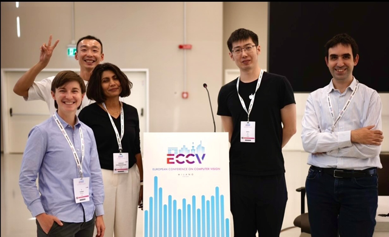
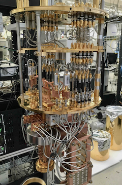

---
# You don't need to edit this file, it's empty on purpose.
# Edit theme's home layout instead if you wanna make some changes
# See: https://jekyllrb.com/docs/themes/#overriding-theme-defaults
layout: home
author_profile: true
---

<!--  -->

## Bio

I lead a machine learning team at [Apple](https://www.apple.com/newsroom/) that translates advances in research to applications in manufacturing. In my present role, my applied research focuses on  domain adaptation and data-efficient machine learning. I am also interested in interpretability and improving control and safety in large language and multimodal models.

<!-- why - how - what -->
I have a PhD in Atomic, Molecular and Optical Physics from [UC Berkeley](http://ultracold.physics.berkeley.edu), and professional experience as a technical leader, machine learning engineer, quantum engineer and startup founder. When I'm not working to understand our world or become a better manager, I enjoy woodworking, cycling, and hiking with my wife and dog. I am also a board member and volunteer assistant instructor at [Impact Bay Area](https://www.impactbayarea.org/cthomas), where we teach self-defense under adrenaline. 

## Research

I am interested in applying and adapting cutting-edge approaches in artificial intelligence to improve product manfacturing, and in fundamental research into what models really learn.
<!-- Most ground-breaking approaches are demonstrated on natural images, and we find that many methods don’t show promising results when applied to real manufacturing scenarios. My work focuses first on the small adaptations that we can apply to leverage today's techniques in smart manufacturing, and second on fundamental research into how models learn and when they memorize.  -->
<!-- A common goal throughout my work is improving data-efficiency, or reducing the number of samples required to train an effective model.  -->
<!-- A common thread across my AI research is data-efficiency - reducing the number of data samples required to train an effective model.  -->
<!-- Data-efficiency, reducing the number of data samples required to train an effective model, is a common thread throughout my work. Today's models require massive volumes of diverse training data. 
 Domain-specific datasets differ meaningfully from the natural images used in traditional machine learning and  -->
My work in physics also encompassed both applications in quantum computing and fundamental research into the nature of quantum mechanics. 

<!-- why - understand and discover, and build something impactful or helpful
how - curiosity, developing broad expertise, find underlying commonalities across fields 
what - physics, engineering and machine learning -->
<!-- I am broadly driven to understand the world and to leverage that understanding to build something impactful and new. Thus far in my career I've applied that lens in physics, engineering and machine learning.  -->

### Artificial Intelligence in Manufacturing
<!-- why - how - what -->

<!-- Why is this important / why is it interesting / why is it hard ?   -->
Successful applications of ML in manufacturing can reduce waste at a global scale while improving the quality of products produced. However, success in manufacturing requires exceptionally high model accuracy on data with low-diversity, a scenario that promotes model memorization and limits adaptability. 

<!-- how do we work  -->
<!-- My team runs experiments applying cutting edge approaches to our domain-specific data. When we identify a promising approach, we publish,  demonstrating our approaches on open-source medical datasets that share many challenges with manufacturing. Finally, we integrate successful approaches into an internal git repo, so that many ML applications can benefit from our work.   -->

<!-- what have we built -->

My team's recent research leverages self-supervised pretraining and language-guided domain adaptation to reduce the volume of annotated device-specific data required to produce an effective model. 
I was an organizer and panelist for the [2024 VISION workshop at ECCV](https://vision-based-industrial-inspection.github.io/eccv-24/), which brought together an international community of researchers to tackle key challenges in Vision-based Industrial Inspection. 

### Interpretability, Alignment and Control of AI
<!-- AI Reasoning, Interpretability and Alignment -->
<!-- why -->
<!-- Today's large models require extremely large datasets, delivered by scraping the whole internet (not humanity’s proudest collection of thoughts). Their predecessors - models that determine what we see on social media, for example - we know can be bad for democracy, teen mental health, and social equity.  -->
With the rise of generative artificial intelligence, I have become increasingly interested in methods to assess and improve alignment of model behavior with creator intent. This is a necessary but insufficient requirement for AI Safety, which concerns the alignment of AI with human values. 

<!-- how -->  I have written about [probing existing AI models](./artificial%20intelligence/sycophancy) to understand their inner representations and learning processes, and the pursuit of training strategies to improve [vision model understanding](./artificial%20intelligence/hierarchical), so that learned concepts can be clearly identified and controlled. 
<!--By examining how models learn, interpret, and generate responses, we can improve model understanding, illuminate clear control parameters, and reduce model dependence on enormous and flawed datasets. -->

### Physics and Quantum Computing

I earned my PhD in Atomic Physics from [UC Berkeley](http://ultracold.physics.berkeley.edu), for which I was awarded the [DOE SCGF](https://science.osti.gov/wdts/scgf) and [NSF GRFP](https://www.nsfgrfp.org) fellowships. Driven to understand quantum systems and the laws that underpin our physical universe, I studied macroscopic quantum states of matter called Bose-Einstein Condensates (BECs) in highly-controlled and well-understood environments. 
Together with my team, I built laser and high-vacuum systems to create, manipulate, and image the quantum wavefunctions of BECs and study how complex properties of real materials emerge. Find an accessible explanation in the first chapter of my dissertation. Based on this research I was recognized as one of [Scientific American's 30 under 30](https://www.scientificamerican.com/article/lindau-claire-thomas/). 

 

I went on to work as a senior engineer and technical lead at [Rigetti Quantum Computing](https://www.rigetti.com/). My work focused on rooting out decoherence sources at interfaces throughout the quantum stack -- from fabrication of superconducting qubit systems, through cryogeneic, electrical, RF, hardware, and software systems.  

<!-- 
More quantum phrases
 systems to manipulate atoms 
 emergence in quantum systems 
 to expand human understanding of quantum physics, the laws that underpin our physical universe.  
 our understanding of the fundamental building blocks of nature and the laws that govern them. 
 studied quantum physics at macroscpic scales 
-->

 
\pagebreak 

## Selected Publications

<small>
[Pretraining with hierarchical memories: separating long-tail and common knowledge](https://arxiv.org/pdf/2510.02375).
Hadi Pouransari, David Grangier, C Thomas, Michael Kirchhof, Oncel Tuzel.
*In-review at ICLR.*
Oct 2025.
<small>

<small>
[LangDA: Language-guided Domain Adaptive Semantic Segmentation](https://openreview.net/forum?id=iyULilaeYx) 
Chang Liu, Saad Hossain, C Thomas, Kwei-Herng Lai, Raviteja Vemulapalli, Sirisha Rambhatla, Alexander Wong. 
*NeurIPS 2024, AFM workshop,*
Nov 2024.
</small>

<small>
[Synth4Seg–Learning Defect Data Synthesis for Defect Segmentation using Bi-level Optimization](https://arxiv.org/abs/2410.18490)
Shancong Mou, Raviteja Vemulapalli, Shiyu Li, Yuxuan Liu, C Thomas, Meng Cao Haoping Bai, Oncel Tuzel, Ping Huang, Jiulong Shan, Jianjun Shi. 
*arXiv:2410.18490,*
Oct 2024.
</small>

<small>
[Mean-field scaling of the superfluid to Mott insulator phase transition
in a 2D optical superlattice](https://journals.aps.org/prl/abstract/10.1103/PhysRevLett.119.100402) 
CK Thomas, Thomas H Barter, Tsz-Him Leung, Masayuki Okano, Gyu-Boong Jo, Jennie Guzman, Itamar Kimchi, Ashvin Vishwanath, Dan Stamper-Kurn 
*Physical Review Letters 119 (10), 100402 (Editor’s Suggestion),*
Sept 2017.
</small>

<small>
[Signatures of spatial inversion asymmetry of an optical lattice observed in matter-wave diffraction](https://journals.aps.org/pra/abstract/10.1103/PhysRevA.93.063613)
CK Thomas, TH Barter, TH Leung, S Daiss, DM Stamper-Kurn. 
*Physical Review A 93 (6), 063613,*
June 2016.
</small>

<!-- ## Career Notes --> 

## Self-Defense

I am a longtime volunteer instructor and recent board member at [Impact Bay Area](https://www.impactbayarea.org/), where we train students to set and hold  boundaries with verbal and physical self-defense skills.  Take a class! 
